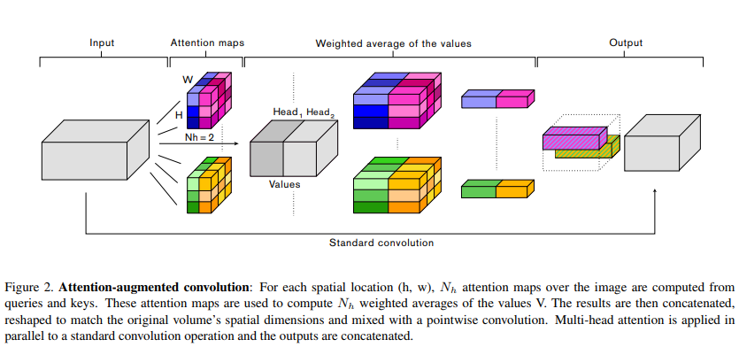

# Implementation of attention-augmented convolution layer.

Tensorflow implementation of the Attention Augmented Convolutional Networks proposed in

Irwan Bello, Barret Zoph, Ashish Vaswani, Jonathon Shlens, Quoc V. Le. [__Attention Augmented Convolutional Networks.__](https://arxiv.org/pdf/1904.09925v1.pdf). _Proc. ICCV_, 2019



A Pytorch implementation can be found from [leaderj1001](Attention-Augmented-Conv2d).

Usage example: 

```
from attn_augconv import AugmentedConv

 #input shape(-1, 64, 64, 3)
 aug_conv_op1 = AugmentedConv(Fin=3, Fout=64, k=(3,3), dk=16, dv=16, Nh=4)
 output = aug_conv_op1.augmented_conv2d(input)
 #output shape (-1, 64, 64, 64)
```
